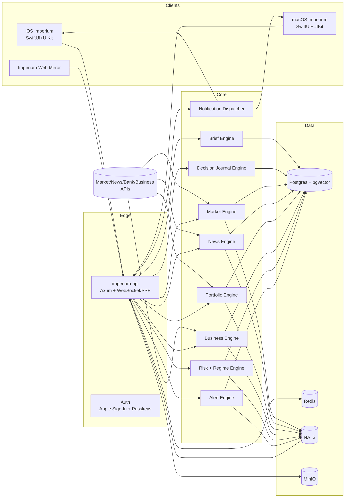

# IMPERIUM Full Product Plan - Sovereign Command Terminal

**Date**: 2026-02-16  
**Repository**: `/Users/jeremyscatigna/project-memory`  
**Objective**: Add a new monorepo app named `imperium` and a new Rust backend, extending the current Docker stack to ship the full Imperium product (not MVP).

---

## 1) Product Contract

Imperium is a private CEO intelligence operating system with one core promise:

- Open at **05:00 local time**.
- Understand global markets + personal/business exposure in **<= 180 seconds**.
- Track live all day with **high-signal alerts only**.

Non-negotiables:

- Rust backend (`axum` + `tokio`) with strict service boundaries.
- Native Apple clients (`SwiftUI + UIKit`) for iPhone + MacBook.
- Evidence-backed AI: no claim without citation.
- Real-time markets and alerts.
- Unified portfolio + business cash command view.
- "Old money / Bloomberg authority" design language.

---

## 2) Monorepo Integration Strategy

Current repo patterns:

- Frontend apps live under `apps/*`.
- Shared JS/TS packages live under `packages/*`.
- Intelligence backend exists separately as `drovi-intelligence/`.
- Docker orchestration is centralized in root compose files.

Imperium structure (new):

```text
apps/
  imperium/                    # New web command surface (internal + ops mirror)
  ios/Imperium/                # New iOS SwiftUI/UIKit target
  macos/Imperium/              # New macOS SwiftUI/UIKit target
services/
  imperium-backend/            # New Rust workspace (API + workers + domain crates)
packages/
  imperium-api-types/          # Generated API contracts for web + tooling
  imperium-design-tokens/      # Shared color/type/spacing token source
openapi/
  imperium-openapi.json        # Generated contract snapshot
```

Why this split:

- Keeps parity with existing app layout (`apps/*`) while isolating Rust backend concerns from Bun workspaces.
- Supports a browser-based command mirror for QA/ops without blocking native-first roadmap.
- Enables strict API contract sharing across web/native/tooling.

---

## 3) Docker Extension Plan (Based on Existing Compose)

### 3.1 Reuse Existing Services

Imperium will reuse existing shared infra where possible:

- `postgres` (source of truth for transactional + vector data)
- `redis` (cache, ephemeral state, throttling)
- `minio` (report exports, evidence artifacts)
- `prometheus` + `grafana` + `alertmanager` (observability)

### 3.2 Add New Services

Add to `docker-compose.yml` (with `profiles: ["imperium"]` where appropriate):

- `imperium-api` (Rust Axum API gateway)
- `imperium-market-worker` (market ingestion + candle builder)
- `imperium-news-worker` (news ingestion + dedupe + clustering)
- `imperium-brief-worker` (daily brief generation + updates)
- `imperium-alert-worker` (alert evaluation + dispatch)
- `imperium-risk-worker` (portfolio risk + regime models)
- `imperium-business-worker` (Stripe/QuickBooks/bank metric sync)
- `imperium-notify-worker` (APNs/email/push dispatch)
- `nats` (low-latency internal event bus for real-time fanout)
- `imperium-web` (new app `apps/imperium` containerized like `web`/`admin`)

### 3.3 Ports and Naming Convention

Proposed:

- `imperium-api`: `8010:8010`
- `imperium-web`: `3010:80`
- `nats`: `4222:4222`, monitor `8222:8222`

Container names:

- `imperium-api`, `imperium-market-worker`, etc. (avoid collision with existing `drovi-*` naming).

### 3.4 Compose Hygiene

- Keep all Imperium services in the same root compose to satisfy "extend current docker config".
- Use `depends_on` with health checks for deterministic startup.
- Add dedicated volumes only when required (e.g., NATS persistence, optional local model cache).
- Keep existing Drovi stack untouched by default using Compose profiles.

---

## 4) System Architecture



Architecture style:

- Modular microservices in one Rust workspace.
- Event-driven internal communication (`nats`) for low-latency updates.
- Strongly typed domain contracts and idempotent worker semantics.

---

## 5) Rust Backend Design (`services/imperium-backend`)

Workspace crates:

- `imperium-api` - HTTP API, WebSocket/SSE, auth, request orchestration.
- `imperium-domain` - entities, value objects, business rules.
- `imperium-market` - market feed adapters, candle aggregation, indicators.
- `imperium-news` - ingestion, dedupe, clustering, topic impact scoring.
- `imperium-brief` - structured brief assembler with citation rules.
- `imperium-portfolio` - holdings, P&L, exposure, net-worth normalization.
- `imperium-business` - Stripe/Polar/QuickBooks/bank business metrics.
- `imperium-risk` - VaR, correlation, scenario, regime detection.
- `imperium-alerts` - rules engine + AI impact classifier + throttling.
- `imperium-notify` - APNs/email/web push dispatch.
- `imperium-journal` - thesis storage, reminders, review workflow.
- `imperium-connectors` - provider clients and mapping layer.
- `imperium-infra` - DB, cache, event bus, telemetry primitives.

Backend contracts:

- API style: REST + streaming endpoints (SSE/WS).
- OpenAPI generation via `utoipa` (or equivalent) into `openapi/imperium-openapi.json`.
- Versioning: `/api/v1/imperium/*`.

---

## 6) Domain and Data Model

Primary entities:

- `user`, `org`, `device`
- `watchlist`, `watchlist_symbol`
- `market_symbol`, `market_tick`, `market_candle`, `market_indicator_snapshot`
- `news_source`, `article`, `article_cluster`, `article_embedding`, `article_impact`
- `portfolio_account`, `portfolio_position`, `portfolio_transaction`, `portfolio_snapshot`
- `business_entity`, `business_metric`, `invoice`, `payroll_event`, `expense_item`
- `alert_rule`, `alert_event`, `alert_delivery`, `alert_snooze`
- `daily_brief`, `brief_section`, `brief_claim`, `brief_citation`
- `decision_thesis`, `thesis_review`, `playbook`, `playbook_trigger`
- `regime_state`, `risk_signal`, `scenario_run`

Data invariants:

- Every `brief_claim` must have >=1 `brief_citation`.
- Alerts are deduped by `(rule_id, entity_id, time_bucket, regime_hash)`.
- Snapshot tables are immutable; corrections are append-only.
- Connector records are fully traceable with source provider IDs.

---

## 7) Module-by-Module Product Plan

## 7.1 Daily Strategic Briefing (05:00 Ritual)

Pipeline:

1. Ingest overnight market/news/business deltas.
2. Cluster duplicate stories.
3. Score impact by user holdings/watchlists/business exposure.
4. Generate strict-format brief sections.
5. Validate citation coverage and confidence thresholds.
6. Publish brief + push "ready" notification at 05:00 local.

Guardrails:

- No uncited claim can be rendered.
- Max 7 required reads.
- End with tactical watchlist (events, levels, risks).

## 7.2 Markets Command

- Multi-asset real-time stream (stocks, ETFs, indices, FX, bonds proxy, crypto).
- Candle intervals: `1m`, `5m`, `15m`, `1h`, `1d`.
- Indicators: VWAP, EMA(20/50/200), RSI, MACD.
- Heatmaps and regime overlay.

## 7.3 Portfolio + Net Worth Engine

- Unified account model: personal, holding, business, crypto, debt, private assets.
- Exposure and concentration diagnostics.
- Correlation matrix, VaR, drawdown, scenario impact.

## 7.4 Business Command

- Stripe/Polar/QuickBooks/bank ingestion.
- MRR, growth, burn, runway, receivables, payroll/tax reserve.
- Anomaly detection (refund spikes, margin compression, runaway spend).

## 7.5 Intelligence Inbox

- Unified feed of newsletters, filings, press, transcripts.
- Dedupe + narrative clustering + impact ranking.
- Reading mode with annotation and "send to thesis" actions.

## 7.6 Decision Journal + Playbooks

- Thesis lifecycle with invalidation criteria and review reminders.
- Playbooks (`if X then Y`) with explicit trigger conditions.
- Journal-to-alert and journal-to-brief loop closure.

## 7.7 Risk + Regime + Scenario Simulation

- Regime classifier (risk-on/off/neutral + confidence).
- Portfolio impact overlays by macro shock type.
- Scenario simulator with hedge sizing guidance.

---

## 8) Native Client Architecture (iOS + macOS)

Implementation strategy:

- Shared Swift package: domain models, API clients, state reducers, design tokens.
- Platform shells:
  - `apps/ios/Imperium` (iPhone-first, widget + notification focus)
  - `apps/macos/Imperium` (multi-pane command station)
- UI composition: SwiftUI for structure, UIKit/AppKit bridging for high-performance charts/grids.

State architecture:

- Unidirectional data flow with explicit feature stores.
- Streaming state channels for live market + alerts.
- Offline cache for latest brief and core watchlists.

Charting strategy:

- Phase 1: TradingView Lightweight Charts wrapper (native container).
- Phase 2: optional custom renderer for ultra-dense desktop "trader mode".

Navigation:

- macOS: 3-pane command station with keyboard routing (`Cmd+1..Cmd+7`, `Cmd+K`).
- iOS: tab shell + right-edge contextual AI panel + lock screen brief widget.

---

## 9) Design System Plan (Old Money / Bloomberg Authority)

Token system (`packages/imperium-design-tokens`):

- Colors:
  - `black_matte`, `charcoal`, `forest`, `burgundy`, `antique_gold`, `parchment`
- Typography roles:
  - Display serif (Didot-style), body serif/grotesk blend, tabular mono for numerics
- Motion:
  - 120-180ms hard fades, no playful bounce, no novelty spring
- Layout:
  - strict grid, heavy separators, high-density information surfaces

Rules:

- No emoji, no neon, no playful gradients.
- Emphasis by hierarchy and spacing, not visual noise.
- Every card answers "what happened / why it matters / what next".

---

## 10) API Surface and Screen Mapping

Core endpoint groups:

- `/brief/*` daily brief, citations, "since last check" deltas
- `/markets/*` quotes, candles, indicators, heatmaps, symbol research
- `/portfolio/*` accounts, positions, net worth, exposures, scenarios
- `/business/*` revenue, burn, runway, invoices, anomalies
- `/intelligence/*` clusters, articles, summaries, relevance scores
- `/risk/*` regime state, macro indicators, shock overlays
- `/journal/*` theses, reviews, playbooks
- `/alerts/*` rules, deliveries, throttling preferences
- `/notifications/*` feed, ack, snooze, preference tuning

Realtime channels:

- `market.tick`, `market.candle`, `alert.triggered`, `portfolio.delta`, `brief.updated`, `risk.regime.changed`

---

## 11) AI Intelligence Specification

## 11.1 Daily Brief Prompt Contract

Input blocks:

- overnight market dataset
- event calendar
- ranked news clusters
- portfolio risk signals
- business metrics summary
- user preference profile

Output schema (strict JSON first, render second):

- section id, title, summary, claims[]
- each claim: `statement`, `impact_score`, `confidence`, `citations[]`, `recommended_action`

Post-generation validators:

- citation coverage check
- confidence floor check
- max item count check
- unsupported-claim rejection

## 11.2 Intelligence Inbox Ranking

Scoring dimensions:

- symbol overlap
- sector overlap
- thesis relevance
- portfolio weight impact
- macro sensitivity
- novelty vs already read

---

## 12) Notifications Strategy

Only three classes shipped:

- Price/volatility structural alerts
- Impact-scored news alerts
- Business operator alerts

Notification payload contract:

- `what_happened`
- `why_it_matters`
- `what_to_watch_next`
- `deep_link`

Anti-spam controls:

- per-rule cooldown windows
- correlated-event suppression
- priority queues
- delivery channel escalation logic

---

## 13) Security, Privacy, and Compliance

Security baseline:

- OAuth-based connector auth only; no raw credential storage.
- Token + secret management via encrypted store.
- Field-level encryption for sensitive account balances/identifiers.
- Immutable audit log for all data changes and alert actions.
- Device-bound sessions + passkeys + Apple Sign In.

Compliance controls:

- Least-privilege connector scopes.
- Provider TOS-safe data ingestion paths.
- Regional data residency options (future institutional tier).
- Full export/delete tooling for user data control.

---

## 14) Performance and Reliability Targets

Targets from product spec:

- Market update to client render: `< 300ms` p95
- Alert dispatch latency: `< 1s` p95
- Portfolio recompute: `< 2s`
- Daily brief generation: `< 20s`

Reliability SLOs:

- API availability >= `99.9%`
- Morning brief delivery success >= `99.5%`
- Connector sync success >= `99%` per day

---

## 15) Delivery Program (Full Product)

Duration: **8-12 months**, parallelized by tracks.

Tracks:

1. Platform + infra (Rust services, docker, observability)
2. Data ingestion + normalization (markets/news/connectors)
3. AI intelligence stack (briefing + ranking + regime)
4. Native apps + design system (iOS/macOS)
5. Risk, alerts, and operator tooling
6. Hardening + compliance + launch operations

Milestone framing:

- M1: Foundation and skeleton services live.
- M2: Markets + News + Brief pipeline complete with citations.
- M3: Portfolio + Business connectors and risk analytics.
- M4: Full native command flows + notifications + regime/scenario.
- M5: Security hardening + institutional polish + launch.

---

## 16) Key Risks and Mitigations

Risk: Real-time equities licensing and cost complexity.  
Mitigation: Multi-provider abstraction + strict SLA/cost dashboards + symbol tiering.

Risk: Connector fragility (banks/brokerages/SMB systems).  
Mitigation: Connector health scoring, retry orchestration, manual override UX.

Risk: AI hallucination in high-stakes briefs.  
Mitigation: citation-required schema, strict confidence thresholds, auto-drop unverifiable claims.

Risk: Alert fatigue.  
Mitigation: impact thresholds, cooldowns, dedupe clusters, user-tunable severity profiles.

Risk: Cross-platform UX drift (iOS vs macOS).  
Mitigation: shared design token package + feature parity contract per module.

---

## 17) Definition of Done (Full Product)

Imperium is done when all statements are true:

- A 05:00 local brief arrives with fully cited claims and tactical watch items.
- Live markets stream with stable 1m candles and actionable alerting.
- Portfolio and business data are unified into one risk-aware command view.
- Intelligence inbox dedupes, clusters, and ranks by actual user impact.
- Decision journal + playbooks close the loop between analysis and action.
- iOS + macOS clients run the full daily founder ritual with minimal friction.
- Observability, security, and audit trails satisfy executive and enterprise expectations.

