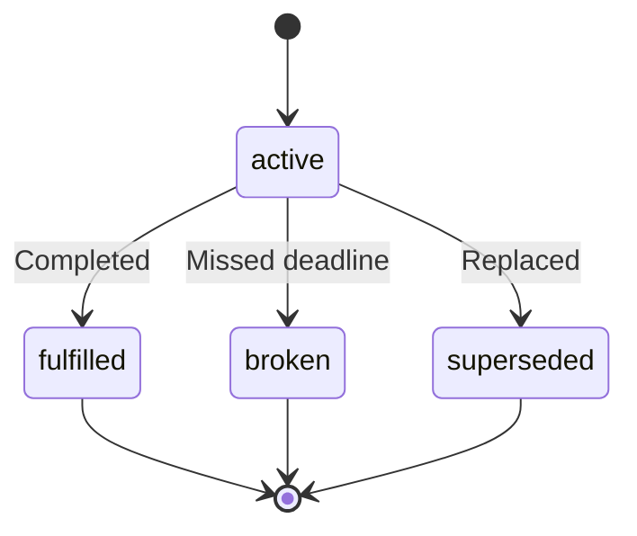

# Commitment Extraction

Commitments are promises between people — who owes what to whom, by when.

## What Is a Commitment?

A commitment is a structured promise with:

| Field | Description | Example |
|-------|-------------|---------|
| `title` | What is promised | "Send the proposal" |
| `owner` | Who made the commitment | Person ID |
| `counterparty` | Who it's promised to | Person ID |
| `direction` | Owed by me or to me | `owed_by_me` |
| `due_date_text` | When it's due | "by Friday" |
| `status` | Current state | `active` |

## Commitment Schema

```typescript
interface Commitment {
  id: string;
  title: string;
  description?: string;

  // Parties
  owner_id: string;
  counterparty_id?: string;
  direction: 'owed_by_me' | 'owed_to_me' | 'mutual';

  // Timing
  due_date?: string;
  due_date_text?: string;

  // Status
  status: 'active' | 'fulfilled' | 'broken' | 'superseded';

  // Confidence
  confidence: number;

  // Evidence
  quoted_text: string;
  episode_id: string;
}
```

## Detection Patterns

### Direct Promises

```
"I will send the report by Friday"
→ direction: owed_by_me, due_date_text: "Friday"

"Can you review the PR today?"
→ direction: owed_to_me (if acknowledged)

"We agreed to deliver by Q2"
→ direction: mutual
```

### Implicit Commitments

```
"I'll handle the client meeting"
→ Implied commitment to manage the meeting

"Let me take a look at that"
→ Implied commitment to review
```

## Status Lifecycle



## Commitment Tracking

### Track Open Commitments

```bash
curl https://api.drovi.io/api/v1/uios?type=commitment&status=active \
  -H "X-API-Key: your_api_key"
```

### Due Soon

```bash
curl https://api.drovi.io/api/v1/uios/due-soon?days=7 \
  -H "X-API-Key: your_api_key"
```

### Overdue

```bash
curl https://api.drovi.io/api/v1/uios/overdue \
  -H "X-API-Key: your_api_key"
```

## Direction Detection

| Pattern | Direction |
|---------|-----------|
| "I will...", "I'll..." | `owed_by_me` |
| "Can you...", "Please..." | `owed_to_me` |
| "We agreed...", "Let's..." | `mutual` |
| "You promised..." | `owed_to_me` |
| "As discussed..." | Context-dependent |

## Fulfillment Detection

Drovi automatically detects when commitments are fulfilled:

```
Original: "I'll send the report by Friday"
Later: "Attached is the report as promised"
→ Status changes to 'fulfilled'
```

## Best Practices

1. **Clear language**: Explicit commitments have higher confidence
2. **Date mentions**: Due dates improve trackability
3. **Named parties**: Who/whom improves resolution
4. **Context**: Include surrounding conversation for accuracy
