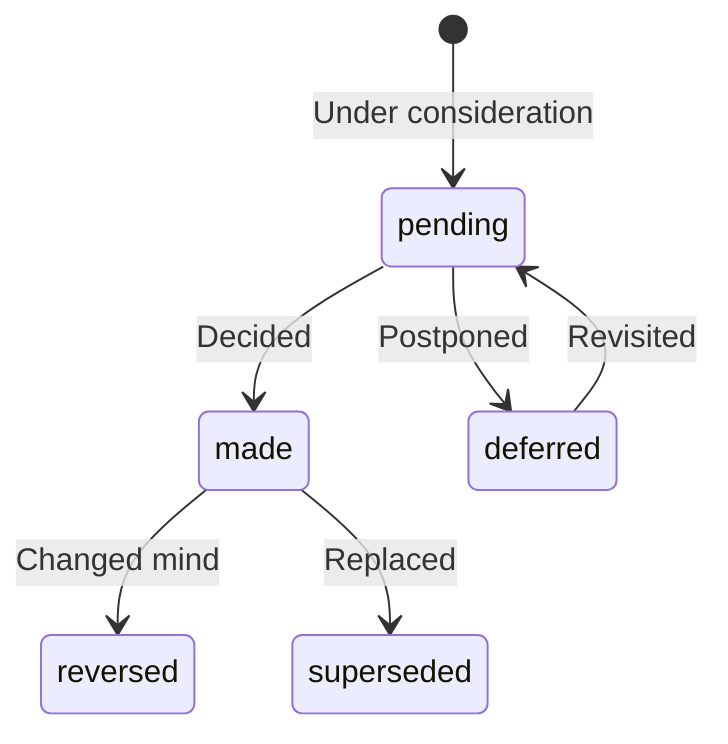

# Decision Extraction

Decisions are choices made — what was decided, why, and what it replaced.

## What Is a Decision?

A decision is a recorded choice with:

| Field | Description | Example |
|-------|-------------|---------|
| `title` | What was decided | "Use React for frontend" |
| `rationale` | Why it was decided | "Better ecosystem support" |
| `alternatives` | What wasn't chosen | ["Vue", "Angular"] |
| `status` | Current state | `made` |
| `superseded_by` | If replaced | Decision ID |

## Decision Schema

```typescript
interface Decision {
  id: string;
  title: string;
  description?: string;

  // Decision details
  rationale?: string;
  alternatives?: string[];
  impact?: string;

  // Parties
  decision_makers?: string[];  // Person IDs
  stakeholders?: string[];     // Affected parties

  // Status
  status: 'made' | 'pending' | 'deferred' | 'reversed';
  superseded_by_id?: string;

  // Temporal
  decided_at?: string;
  valid_from?: string;
  valid_to?: string;

  // Confidence
  confidence: number;

  // Evidence
  quoted_text: string;
  episode_id: string;
}
```

## Detection Patterns

### Explicit Decisions

```
"We decided to go with Option B"
→ title: "Go with Option B", status: made

"After discussion, we're moving forward with the new pricing"
→ title: "New pricing structure", status: made
```

### With Rationale

```
"We chose React because it has better community support"
→ title: "Use React", rationale: "better community support"
```

### With Alternatives

```
"We considered Vue and Angular but decided on React"
→ alternatives: ["Vue", "Angular"]
```

## Status Lifecycle



## Supersession Tracking

When a decision is replaced:

```json
{
  "id": "dec_original",
  "title": "Use weekly sprints",
  "status": "superseded",
  "superseded_by_id": "dec_new",
  "valid_to": "2024-01-15T00:00:00Z"
}
```

The new decision:

```json
{
  "id": "dec_new",
  "title": "Switch to bi-weekly sprints",
  "supersedes_id": "dec_original",
  "valid_from": "2024-01-15T00:00:00Z"
}
```

## Query Decisions

### Active Decisions

```bash
curl https://api.drovi.io/api/v1/uios?type=decision&status=made \
  -H "X-API-Key: your_api_key"
```

### Decision History

```bash
curl https://api.drovi.io/api/v1/uios/{decision_id}/history \
  -H "X-API-Key: your_api_key"
```

### Decisions by Topic

```bash
curl https://api.drovi.io/api/v1/search \
  -H "X-API-Key: your_api_key" \
  -d '{"query": "pricing decisions", "types": ["decision"]}'
```

## Bi-Temporal Queries

Query decisions as they were at a point in time:

```bash
curl https://api.drovi.io/api/v1/uios?type=decision&as_of=2024-01-01 \
  -H "X-API-Key: your_api_key"
```

## Best Practices

1. **Capture rationale**: Include "because" context
2. **Note alternatives**: What wasn't chosen helps future understanding
3. **Track stakeholders**: Who was involved or affected
4. **Link related decisions**: Build decision trees
