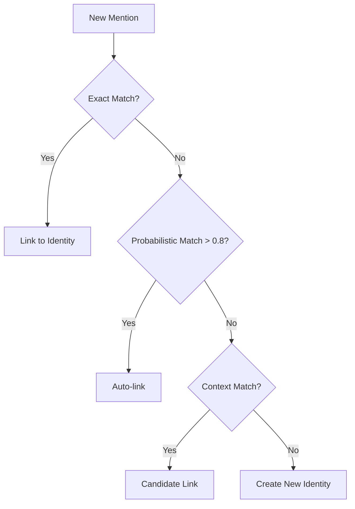

# Entity Resolution

Entity resolution ensures the same person, company, or project is recognized everywhere — across all sources.

## The Problem

The same person appears differently across sources:

| Source | Identifier |
|--------|------------|
| Email | john.smith@company.com |
| Slack | @johnsmith |
| CRM | Contact ID 12345 |
| Meeting notes | "John from Engineering" |

Without resolution, these are treated as four different people.

## How Resolution Works

### Three-Level Matching

```
Level 1: Exact Match
  - Email addresses
  - Phone numbers
  - Social handles

Level 2: Probabilistic Match
  - Name similarity
  - Company affiliation
  - Communication patterns

Level 3: Context-Based
  - Mentioned together
  - Same conversation thread
  - Role/title matching
```

### Resolution Flow



## Identity Schema

```typescript
interface Identity {
  id: string;
  type: 'person' | 'organization' | 'project';

  // Canonical info
  display_name: string;
  primary_email?: string;

  // Linked identifiers
  identifiers: {
    emails: string[];
    phones: string[];
    slack_ids: string[];
    linkedin_urls: string[];
    crm_ids: string[];
  };

  // Aliases
  aliases: string[];  // "John", "JS", "Johnny"

  // Confidence
  resolution_confidence: number;

  // Verification
  verified: boolean;
  verified_at?: string;
}
```

## Contact Resolution

### Pre-Extraction Resolution

Before extracting intelligence, contacts are resolved:

```json
{
  "input": "John promised to send the report",
  "resolved": {
    "owner_id": "identity_john_smith",
    "owner_name": "John Smith",
    "owner_email": "john@company.com"
  }
}
```

### Post-Extraction Linking

After extraction, entities are linked to resolved identities:

```json
{
  "commitment": {
    "title": "Send the report",
    "owner_id": "identity_john_smith"  // Resolved
  }
}
```

## Organization Resolution

Companies are also unified:

| Source | Mention |
|--------|---------|
| Email domain | @acme.com |
| CRM | Acme Corporation |
| Slack | "the Acme team" |
| Notes | "ACME Inc." |

All resolve to the same organization entity.

## Query Resolved Entities

### Get Identity

```bash
curl https://api.drovi.io/api/v1/entities/{identity_id} \
  -H "X-API-Key: your_api_key"
```

### Search by Identifier

```bash
curl https://api.drovi.io/api/v1/entities/resolve?email=john@company.com \
  -H "X-API-Key: your_api_key"
```

### Find Candidates

```bash
curl https://api.drovi.io/api/v1/entities/candidates?name=John%20Smith \
  -H "X-API-Key: your_api_key"
```

## Manual Linking

### Merge Identities

```bash
curl -X POST https://api.drovi.io/api/v1/entities/merge \
  -H "X-API-Key: your_api_key" \
  -d '{
    "primary_id": "identity_1",
    "secondary_id": "identity_2"
  }'
```

### Unlink (Split)

```bash
curl -X POST https://api.drovi.io/api/v1/entities/split \
  -H "X-API-Key: your_api_key" \
  -d '{
    "identity_id": "identity_1",
    "identifiers_to_split": ["email@other.com"]
  }'
```

## Resolution Confidence

Each link has a confidence score:

| Score | Meaning | Action |
|-------|---------|--------|
| 0.95+ | Definite match | Auto-linked |
| 0.80-0.95 | Likely match | Auto-linked with flag |
| 0.50-0.80 | Possible match | Manual review suggested |
| < 0.50 | Unlikely match | Separate identities |

## Best Practices

1. **Provide email addresses**: Highest confidence matching
2. **Use consistent handles**: Same @username across tools
3. **Review suggested merges**: Catch false positives early
4. **Verify key contacts**: Mark important identities as verified
