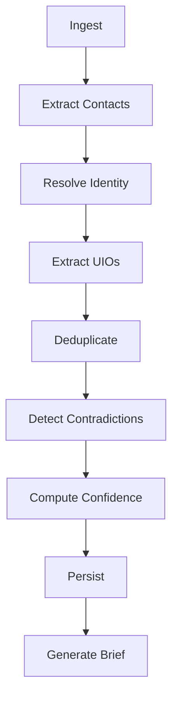

# Intelligence Extraction

Drovi's intelligence layer extracts structured knowledge from unstructured content — turning conversations into queryable objects.

## What Gets Extracted

| Type | Description | Example |
|------|-------------|---------|
| **Commitments** | Who owes what to whom, by when | "I'll send the report by Friday" |
| **Decisions** | What was decided, with rationale | "We decided to go with Option B" |
| **Tasks** | Actionable work items | "TODO: Update the documentation" |
| **Risks** | Contradictions, violations, concerns | "This contradicts what we agreed last week" |
| **Questions** | Open loops needing answers | "What's the timeline for this?" |
| **Claims** | Factual statements | "Our revenue grew 40% this quarter" |

## How It Works

```
Content → Orchestrator → Extraction → Resolution → Graph
```

1. **Content Ingestion**: Raw text from any source
2. **Orchestration**: LangGraph pipeline with 16+ nodes
3. **Extraction**: LLM-powered structured extraction
4. **Resolution**: Entity deduplication and linking
5. **Persistence**: Knowledge graph storage

## Extraction Pipeline

The intelligence orchestrator is a LangGraph state machine:



## Confidence Scoring

Every extraction includes a confidence score (0.0-1.0):

```json
{
  "title": "Send quarterly report",
  "confidence": 0.92,
  "evidence": {
    "quoted_text": "I will send the quarterly report by Friday",
    "source_id": "email_123"
  }
}
```

Factors affecting confidence:
- **Explicitness**: Direct statements vs. implied
- **Context**: Supporting context available
- **Ambiguity**: Multiple interpretations possible
- **Source**: Original content vs. forwarded

## Evidence Chain

Every extracted object links back to source evidence:

```json
{
  "id": "comm_abc",
  "title": "Complete project review",
  "evidence": {
    "quoted_text": "I'll complete the project review by EOD",
    "source_type": "slack",
    "source_id": "msg_xyz",
    "episode_id": "ep_123"
  }
}
```

## Learn More

<Cards>
  <Card title="Commitments" href="/intelligence/commitments">
    How commitments are extracted and tracked
  </Card>
  <Card title="Decisions" href="/intelligence/decisions">
    Decision extraction with rationale and alternatives
  </Card>
  <Card title="Risks" href="/intelligence/risks">
    Automatic risk and contradiction detection
  </Card>
  <Card title="Entity Resolution" href="/intelligence/entity-resolution">
    Cross-source identity matching
  </Card>
</Cards>
